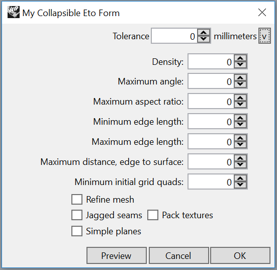
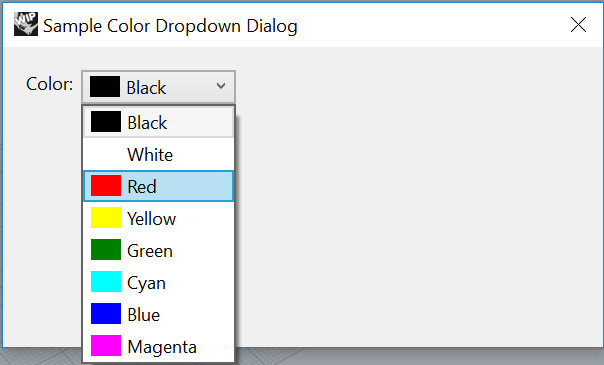
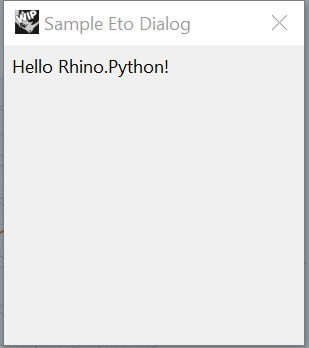
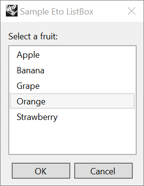
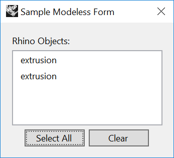
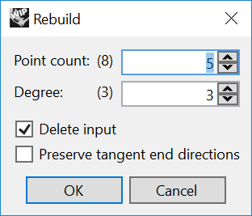
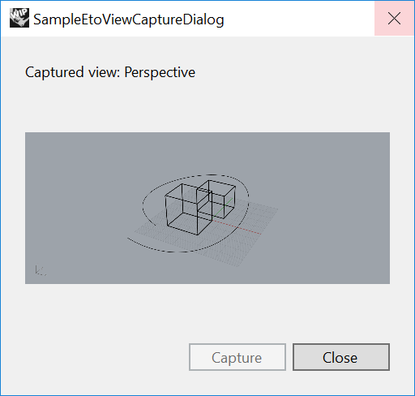
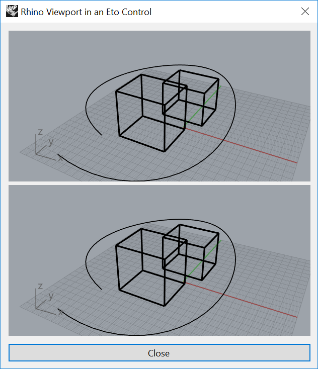

# RhinoPython sample scripts

This folder includes Rhino sample files in Python.

### SampleEtoCollapsibleDialog
This sample script shows how to create a collapsible dialog using Eto.

### SampleEtoColorDropDown
This sample script shows how to create a color dropdown in Rhino using Eto.

### SampleEtoDialog
This sample script shows how to create a simple dialog with some text using Eto.

### SampleEtoListBoxDialog
This sample script shows how to create a clickable list box dialog using Eto.

### SampleEtoModelessForm
This sample script shows how to create a Modeless form using Eto. A Modelless form
allows the user to interact with the Rhino environment while the form is open.

### SampleEtoRebuildCurve
This sample script shows how to rebuild a curve in Rhino and add it to the Rhino document.

### SampleEtoViewCaptureDialog
This sample script shows how to capture a view port and insert it into the form.

### SampleEtoViewports
This sample script shows how to include Rhino viewports inside an Eto form.

